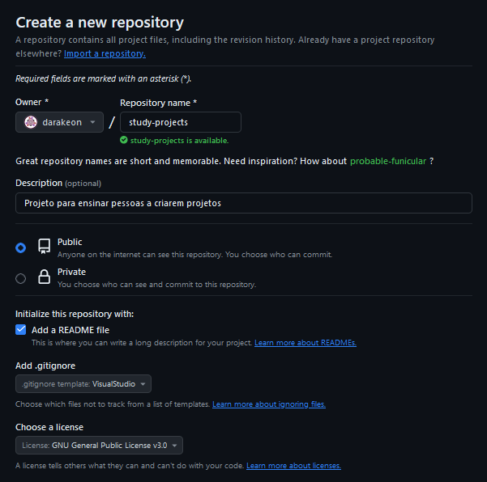
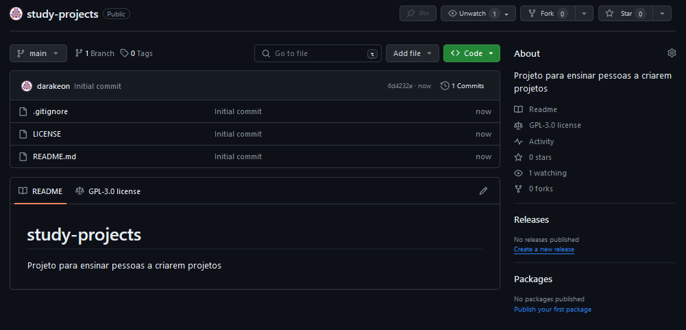
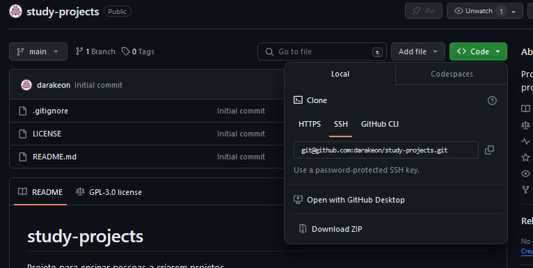
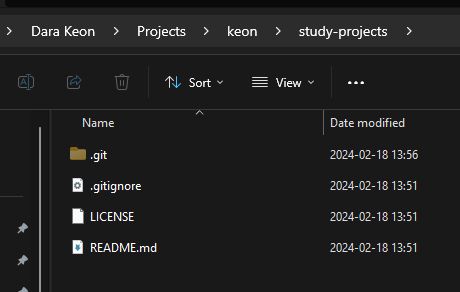

# Repositório

## Repositório no Github

Primeiro eu criei um repositório novo no [Github] < este link abre a
página para criar um repositório novo, e preferi deixar o link aqui pois
apesar da maior parte da interface do Github me parecer boa, encontrar
como criar um repositório novo pode ser confuso.



Vou detalhar abaixo cada um dos campos que existem na hora de criar um
repositório novo no Github.

No campo "Repository name" eu dei o nome "study-projects", pois estamos
fazendo um projeto de estudos. Se estivermos falando de um projeto
dentro de uma empresa que você trabalha, tente seguir os padrões de
nomes já usados na empresa. Se for uma entrevista, coloque o nome
completo do projeto, será mais fácil para quem for analisar.

No campo "Description" coloquei um texto curto sobre a finalidade do
repositório.

Para escolher entre "Public" e "Private", deixei o repositório público,
pois criei ele para ajudar pessoas a aprenderem.

A opção "Add a README file" irá adicionar no seu repositório um arquivo
README.md que terá dentro apenas o nome do arquivo.

Em "Add .gitignore" existe uma lista para ser escolhida uma linguagem de
programação. Todo projeto de programação produz e usa arquivos que não
precisam ser colocados no repositório, e isso tem dois motivos:

- O arquivo é criado por alguma ferramenta de desenvolvimento
automaticamente e deve ser recriado toda vez;

- O arquivo contém informações sigilosas que podem ser perigosas se
expostas, como senhas por exemplo.

O projeto que vou desenvolver aqui possui diversas linguagens de
programação. Decidi usar como exemplo o .gitignore do Visual Studio por
causa do Backend em C#.

Ao final, no campo "Choose a license", eu escolhi a GNU General Public
License v3.0 pois ela é uma licença clássica para quando você quer
permitir que as pessoas usem o seu código, mas impedir elas de tornar
ele um código privado. Caso você queira deixar as pessoas usarem como
quiserem, você pode escolher a licença MIT.

E o projeto fica assim:



[Clique aqui para ver como ficou o repositório de exemplo no Github após o primeiro commit]


## Repositório na sua máquina

Agora precisamos ter o repositório no nosso computador para começar a
trabalhar no projeto. Para isso, iremos fazer uma cópia do repositório
no nosso computador. Essa cópia será constantemente sincronizada com o
repositório que temos no Github.

Para fazer essa cópia precisamos do endereço do seu repositório na
internet. Esse fica na página do seu repositório. Lá existe um botão
escrito "Code <>". Clique nesse botão e copie o endereço que aparece
dentro do campo.



Agora escolha uma pasta no seu computador para colocar projetos. Abra
essa pasta em um terminal. Vamos rodar um comando que irá fazer uma
cópia do que temos no Github e irá criar uma pasta no seu computador
para essa cópia. Execute no terminal, substituindo "(endereço do seu
projeto)" pelo endereço que você copiou do github:

```
git clone (endereço do seu projeto)
```

Por exemplo, no caso deste projeto "Study Projects":

```
git clone git@github.com:darakeon/study-projects.git
```

No meu caso, foi criada uma pasta "study-projects" dentro da pasta onde
executei o comando. Nessa pasta "study-projects" apaceram os arquivos
que já existiam no Github.




## README

Para fechar a estrutura do projeto, vamos falar do README. A ideia
original do README é falar sobre o projeto para quem acabou de iniciar
seu trabalho no projeto.

Se eu faço um projeto para entrevistas, eu tento colocar o texto que a
empresa me mandou dentro do README. Isso tem dois motivos:
- Achar o texto rápido para eu poder reler se necessário;
- Quem for olhar o repositório depois terá o texto também.

No caso desse repositório eu vou ir preenchendo o README enquanto
desenvolvo, e da mesma forma o README de um projeto pode ir evoluindo
com o passar de suas etapas.

[Clique aqui para ver como ficou o repositório de exemplo no Github após o texto sobre Repositório ser adicionado]


[Github]:https://github.com/new
[Clique aqui para ver como ficou o repositório de exemplo no Github após o primeiro commit]:https://github.com/darakeon/study-projects/tree/0-first-commit
[Clique aqui para ver como ficou o repositório de exemplo no Github após o texto sobre Repositório ser adicionado]:https://github.com/darakeon/study-projects/tree/1-repo-text
