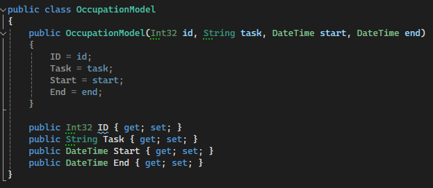

# Backend do Projeto

Vamos criar o backend em C#. Para isso, iremos usar o Visual Studio para
criar um novo projeto. Colocaremos ele dentro da pasta [src](../src) na
raiz do repositório. Dentro dela, criaremos uma pasta
[backend](../src/backend).

Primeiro vamos pedir ao Visual Studio para criar o projeto:

Depois vamos escolher o tipo (queremos uma API em C#):

Então dizemos o nome do projeto, lugar no sistema operacional onde ele
será guardado e o nome da solution. Você pode seguir o padrão abaixo:

Por fim iremos selecionar as opções que queremos. Eu deixei o que já
estava pré-selecionado:

---

## Executando o projeto e criando um endpoint de exemplo

O projeto já vem com uma url de exemplo:
https://localhost:7065/WeatherForecast

O conteúdo dessa URL vem do arquivo WeatherForecastController.cs. Optei
por remover esse arquivo.

Depois disso, vou criar meu próprio Controller. Os Controller são o
lugar onde os requests são recebidos.

O projeto de exemplo será armazenar ações que a pessoa está fazendo e o
tempo que leva. Por exemplo: comecei a mexer neste repositório hoje
20:20. Quando eu parar de fazer isso, vou começar outra coisa que irá
ocupar meu tempo. A palavra que achei que melhor descreve isso é
"ocupação" pois irei registrar como estou ocupando meu tempo.

Meu Controller então irá se chamar OccupationsController. Para me
comunicar com o banco de dados usarei uma classe OccupationsModel. Segue
abaixo um print de uma versão de exemplo das duas classes:

[Clique aqui para ver como ficou o repositório de exemplo após a criação do projeto de backend com a url contendo dados de exemplo]

---

## Comunicando com o banco de dados

Para guardarmos os dados no banco, primeiro precisamos ter uma tabela
criada no banco de dados. Para criar a tabela, vamos criar uma nova
pasta no [src](../src) chamada [database](../src/database). Dentro dela
criaremos nossos códigos SQL para poder criar tabelas no banco de dados.

O primeiro exemplo de script SQL:
[0-create-occupations-table.sql](../src/database/0-create-occupations-table.sql)

Após executá-lo, haverá uma tabela Occupations no banco de dados onde
poderemos de fato guardar novas Occupations que sejam registradas e
posteriormente listar elas.

[Clique aqui para ver como ficou o repositório de exemplo após a criação do projeto de backend com a url contendo dados de exemplo]:https://github.com/darakeon/study-projects/tree/3-backend-example-data
