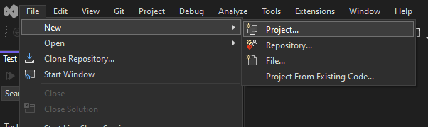
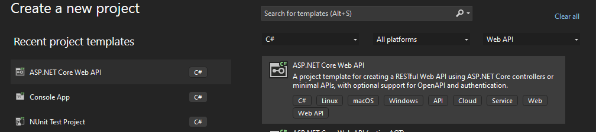
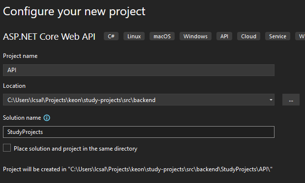
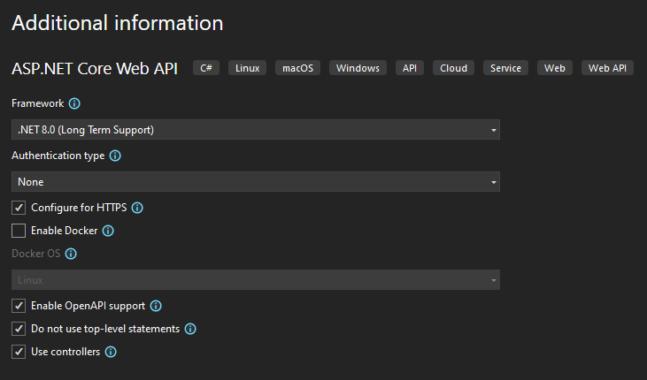

# Backend do Projeto

Vamos criar o backend em C#. Para isso, iremos usar o Visual Studio para
criar um novo projeto. Colocaremos ele dentro da pasta [src](../src) na
raiz do repositório. Dentro dela, criaremos uma pasta
[backend](../src/backend).

Primeiro vamos pedir ao Visual Studio para criar o projeto:

Depois vamos escolher o tipo (queremos uma API em C#):

Então dizemos o nome do projeto, lugar no sistema operacional onde ele
será guardado e o nome da solution. Você pode seguir o padrão abaixo:

Por fim iremos selecionar as opções que queremos. Eu deixei o que já
estava pré-selecionado:

